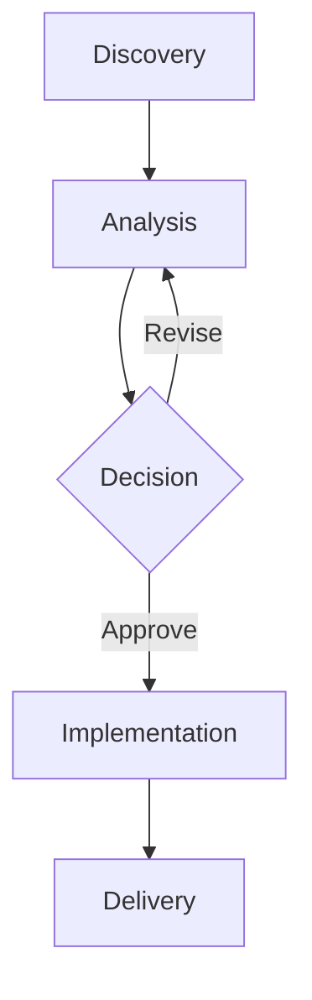
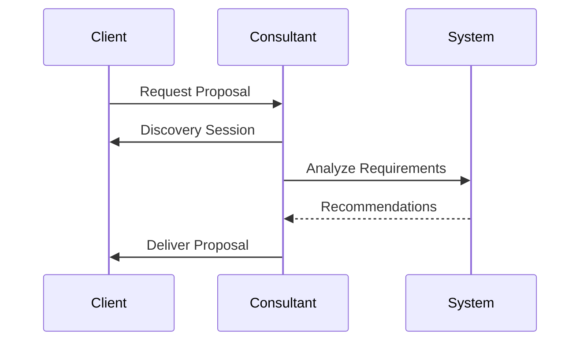
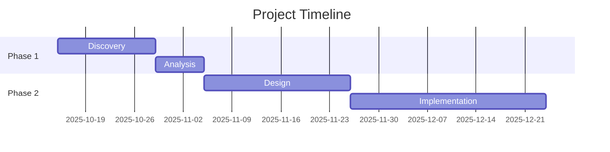
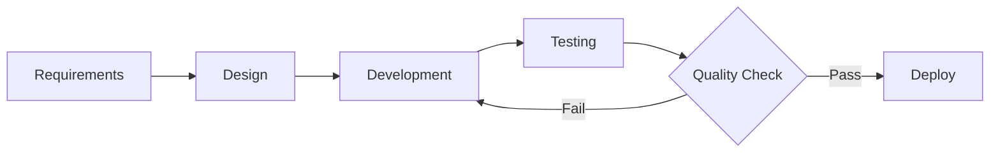

# Ask the Human - Proposal System

Professional proposal generation system for askthehuman.com consulting business. Write proposals in Markdown, export to professional PDFs with your branding.

## Features

- Write proposals in clean, version-controllable Markdown
- Professional styling matching your brand
- Automatic logo inclusion
- Full control over page breaks
- PDF export with perfect formatting
- Reusable templates

## Quick Start

### 1. Install Dependencies

```bash
npm install
```

### 2. Create a New Proposal

Copy the template or example:

```bash
cp templates/proposal-template.md proposals/my-proposal.md
```

Edit your proposal in `proposals/my-proposal.md`

### 3. Build PDF

```bash
# Build the most recent proposal
npm run build

# Build all proposals
npm run build:all

# Build a specific proposal
npm run build proposals/my-proposal.md
```

PDFs will be generated in the `output/` directory.

## Directory Structure

```
proposals/
├── proposals/           # Your proposal markdown files
├── templates/          # Reusable templates
├── assets/
│   ├── css/           # Styling (edit proposal-style.css)
│   └── ATH_logo_transparent.png.png  # Your logo
├── scripts/           # Build scripts
├── output/            # Generated PDFs (gitignored)
└── README.md
```

## Writing Proposals

### Frontmatter

Every proposal should start with metadata:

```markdown
---
title: "Project Proposal"
client: "Client Name"
date: "2025-10-14"
prepared_by: "Bert Carroll"
company: "Ask the Human LLC"
---
```

### Page Breaks

Control exactly where pages break:

```markdown
## Section 1

Content here...

<div class="page-break"></div>

## Section 2

Next page content...
```

### Special Components

**Metadata Box:**
```markdown
<div class="meta-info">
  <div class="meta-item">
    <div class="meta-label">Client</div>
    <div class="meta-value">Acme Corp</div>
  </div>
</div>
```

**Phase Box:**
```markdown
<div class="phase-box">
<div class="phase-header">
  <div class="phase-title">Phase 1: Discovery</div>
  <div class="phase-duration">2-3 Weeks</div>
</div>
<div class="phase-gate">Gate: Discovery Report Acceptance</div>

Content here...
</div>
```

**Investment Box:**
```markdown
<div class="investment-box">
<div class="investment-amount">$8,000/month</div>

Details here...
</div>
```

**Callout Boxes:**
```markdown
<div class="callout">
Regular callout
</div>

<div class="callout success">
Success message
</div>

<div class="callout warning">
Warning message
</div>
```

**Signature Section:**
```markdown
<div class="signature-section">
<div class="signature-grid">
  <div class="signature-block">
    <div class="signature-label">Client: Company Name</div>
    <div class="signature-line"></div>
    <div class="signature-field"><strong>Name:</strong> _______</div>
    <div class="signature-field"><strong>Title:</strong> _______</div>
    <div class="signature-field"><strong>Date:</strong> _______</div>
  </div>
</div>
</div>
```

### Tables

Standard Markdown tables work great:

```markdown
| Phase | Duration | Cost |
|-------|----------|------|
| Phase 1 | 2 weeks | $8,000 |
| Phase 2 | 3 weeks | $12,000 |
```

### Mermaid Diagrams

Mermaid diagrams are fully supported for flowcharts, sequence diagrams, Gantt charts, and more:

**Flowchart:**
````markdown

````

**Sequence Diagram:**
````markdown

````

**Gantt Chart:**
````markdown

````

**Process Flow:**
````markdown

````

See [Mermaid documentation](https://mermaid.js.org/) for all diagram types and options.

## Customization

### Update Logo

Replace `assets/ATH_logo_transparent.png.png` with your logo. The build script will automatically embed it.

### Modify Styling

Edit `assets/css/proposal-style.css` to customize:
- Colors (see color variables at top)
- Fonts
- Spacing
- Layout

### Company Information

Update company details in `scripts/build-proposals.js`:

```javascript
const COMPANY_INFO = {
  name: 'Ask the Human LLC',
  email: 'bert@askthehuman.com',
  address: '426 Maplegrove Drive',
  city: 'Franklin, TN 37064',
  country: 'United States'
};
```

## Tips

1. **Version Control:** Commit your markdown files to git for full version history
2. **Page Breaks:** Use `<div class="page-break"></div>` strategically to control PDF pagination
3. **Preview HTML:** The build process also generates HTML files in `output/` for quick preview
4. **Reuse Content:** Create templates for common proposal sections
5. **Tables:** Keep tables concise - they won't break across pages

## Build Process

The build script:
1. Reads your Markdown file
2. Extracts frontmatter metadata
3. Converts Markdown to HTML
4. Applies professional CSS styling
5. Embeds your logo
6. Generates PDF using Puppeteer

## Troubleshooting

**Build fails with "puppeteer not found":**
```bash
npm install
```

**Logo not appearing:**
- Check that `assets/ATH_logo_transparent.png.png` exists
- Verify the filename in `scripts/build-proposals.js`

**Page breaks not working:**
- Ensure you're using `<div class="page-break"></div>` exactly
- Check that content before/after isn't forcing overflow

**PDF formatting looks off:**
- Review the HTML output in `output/` directory first
- Adjust CSS in `assets/css/proposal-style.css`
- Tables that are too wide may need adjustment

## Examples

See `proposals/example-proposal.md` for a complete example with all components.

## Contact

Questions or issues? Contact bert@askthehuman.com
