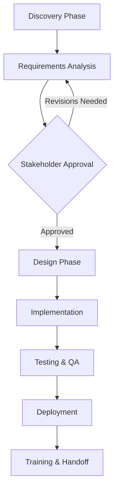
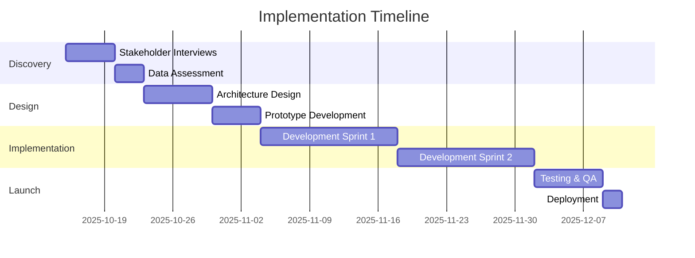
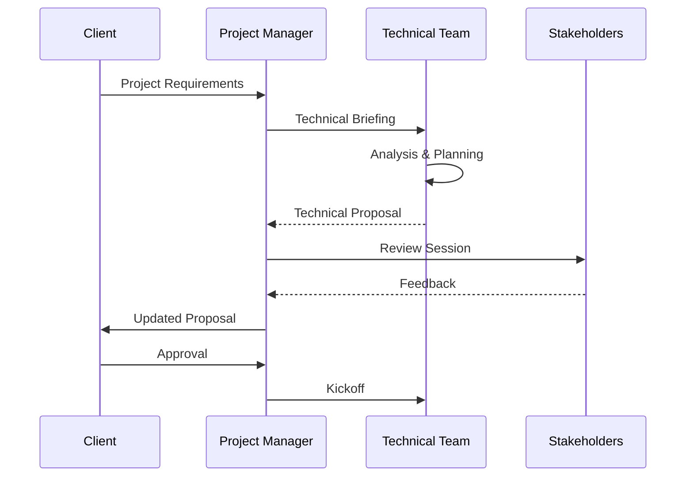

# Project Timeline

Here's our proposed approach:

```mermaid
graph TD
    A[Discovery Phase] --> B[Requirements Analysis]
    B --> C{Stakeholder Approval}
    C -->|Approved| D[Design Phase]
    C -->|Revisions Needed| B
    D --> E[Implementation]
    E --> F[Testing & QA]
    F --> G[Deployment]
    G --> H[Training & Handoff]
```

## Project Phases

```mermaid
gantt
    title Implementation Timeline
    dateFormat YYYY-MM-DD
    section Discovery
    Stakeholder Interviews    :a1, 2025-10-15, 5d
    Data Assessment          :a2, after a1, 3d
    section Design
    Architecture Design      :a3, after a2, 7d
    Prototype Development    :a4, after a3, 5d
    section Implementation
    Development Sprint 1     :a5, after a4, 14d
    Development Sprint 2     :a6, after a5, 14d
    section Launch
    Testing & QA            :a7, after a6, 7d
    Deployment              :a8, after a7, 2d
```

## Communication Flow

```mermaid
sequenceDiagram
    participant C as Client
    participant PM as Project Manager
    participant T as Technical Team
    participant S as Stakeholders

    C->>PM: Project Requirements
    PM->>T: Technical Briefing
    T->>T: Analysis & Planning
    T-->>PM: Technical Proposal
    PM->>S: Review Session
    S-->>PM: Feedback
    PM->>C: Updated Proposal
    C->>PM: Approval
    PM->>T: Kickoff
```

This ensures clear communication throughout the engagement.
