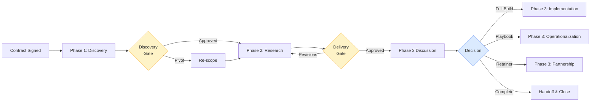
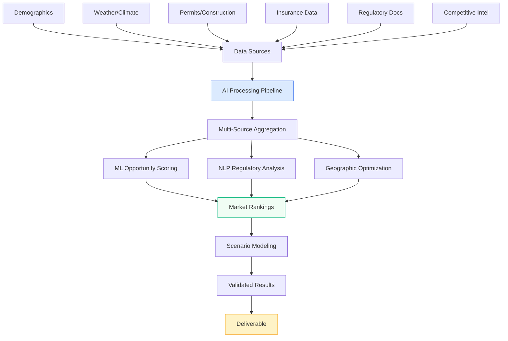
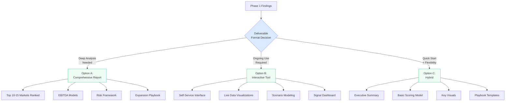
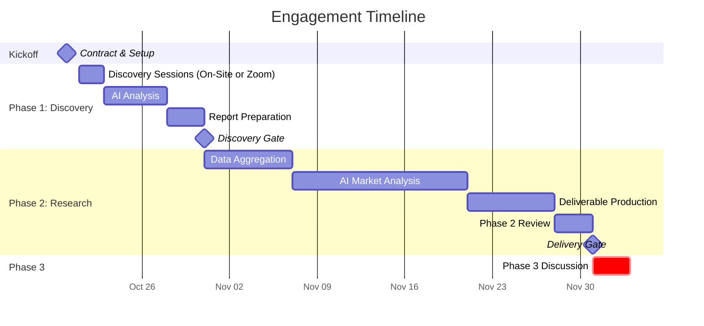

# Statement of Work
## AI-Driven Market Intelligence System

---

**Ask the Human LLC**  
Bert Carroll  
bert@askthehuman.com  
426 Maplegrove Drive  
Franklin, TN 37064  
United States

---

**Client:** TrussPoint Roofing & Exteriors  
**Prepared:** October 13, 2025  
**Engagement Type:** Discovery + Research  
**Document Version:** 1.0

---

## Executive Summary

TrussPoint seeks to systematize greenfield market expansion through Artificial Intelligence (AI)-powered analysis, as stated by TrussPoint leadership, targeting a potential 6–9× valuation improvement via a repeatable site selection methodology. This engagement delivers strategic market intelligence and decision frameworks—with execution approach determined by discovery findings.

### About Ask the Human

**Ask the Human operates as an AI-accelerated builder studio.**
Where traditional consultants analyze and advise, we build intelligent systems that execute. Every engagement blends strategic insight with hands-on creation—leveraging AI not to replace thinking, but to compress the time between concept and build. The consulting and analysis frameworks exist to ensure what we build is directionally correct, measurable, and ready to scale.

### Engagement Flow

---

## Phase 1: Discovery & Requirements

**Duration:** 2-3 Weeks  
**Gate:** Discovery Report Acceptance

### What You Get

#### Discovery Sessions (1-2 days)

**Preferred:** On-site for deeper engagement and context
**Alternative:** Remote via Zoom if scheduling requires

- Leadership interviews (Chief Executive Officer (CEO), Chief Financial Officer (CFO), Chief Operating Officer (COO))
- Key staff sessions (operations, marketing, estimating)
- Historical performance deep dive
- Current decision process mapping
- Data access assessment

#### AI-Accelerated Analysis

**Speed Without Quality Compromise:** AI automation compresses 4-6 weeks of traditional consulting analysis into days, enabling faster market entry decisions and competitive advantage.

- Automated transcription and pattern extraction
- Gap analysis on existing data sources
- Preliminary market opportunity scoring model
- Competitive intelligence synthesis
- Velocity baseline establishment

**Business Impact:** Faster insights → faster expansion decisions → accelerated ROI and valuation growth.

### Deliverable: Discovery Report

#### 1. Current State Assessment

- Decision workflow documentation
- Stakeholder consensus on success metrics
- Historical performance patterns

#### 2. Data Availability Matrix

- **What exists:** Internal data, marketing analytics
- **What's missing:** Data gaps to fill
- **What's accessible:** Application Programming Interface (API) sources, public data

#### 3. Critical Decision: Output Format

- **Report** - Comprehensive written analysis
- **Tool** - Interactive dashboard/scoring system
- **Hybrid** - Executive summary + basic model

#### 4. Phase 2 Scope Recommendation

- Specific data sources to aggregate
- Analysis approach based on findings
- Estimated effort range (will firm up scope)

#### 5. Phase 3 Preview (if execution recommended)

- Potential paths: full build, playbook, retainer, handoff
- Preliminary cost range

**Hours Included:** 40 hours (2 travel days + 2 on-site + consolidation)

---

## Phase 2: Research & Intelligence Delivery

**Duration:** 3-5 Weeks  
**Gate:** Deliverable Acceptance → Phase 3 Discussion

### Core Analysis (Regardless of Format)

#### Market Intelligence Across:

- Demographics & population growth trajectories
- Weather patterns & climate risk (hail, wind, hurricanes)
- Average roof age & replacement timing by region
- New construction pipeline & building permits
- Insurance regulations, claim rates, reimbursement patterns
- Supplier/Third-Party Logistics (3PL) warehouse proximity
- Local/state regulatory complexity scoring
- Competitive density & market saturation analysis
- 2-day lead response feasibility mapping
- Earnings Before Interest, Taxes, Depreciation, and Amortization (EBITDA) projection models

#### AI-Powered Methods:

**Key Methods:**
- Multi-source data aggregation (15-20 public/commercial sources)
- Machine Learning (ML) opportunity scoring algorithms
- Natural Language Processing (NLP) for regulatory documents
- Geographic optimization for operational constraints
- Competitive landscape web intelligence
- Scenario modeling & sensitivity analysis

Analysis is conducted using a Python-based aggregation pipeline with AI models (OpenAI / Claude) for synthesis, reviewed by human analysts before delivery.

**AI Acceleration Advantage:** Traditional consultants require 8-12 weeks for this analysis. AI-powered automation delivers equivalent depth in 3-5 weeks while processing exponentially more data points. This speed advantage translates directly to competitive positioning—enter high-opportunity markets before competitors identify them.

### Deliverable: Format Determined in Phase 1

#### Option A: Comprehensive Report

- Market analysis with top 10-15 ranked opportunities
- EBITDA projection models by market
- Risk/opportunity assessment framework
- Supplier/3PL proximity heat maps
- Regulatory complexity indices
- Expansion decision playbook

#### Option B: Interactive Tool/Dashboard

- Self-service market scoring interface
- Data visualization suite (maps, charts, rankings)
- Scenario comparison capabilities
- Exportable decision summaries
- Signal-style real-time dashboard

#### Option C: Hybrid

- Executive summary (15-20 pages)
- Basic spreadsheet/scoring model
- Key visualizations
- Playbook documentation

#### Always Included:

- Methodology documentation
- Data source bibliography
- Validation against historical performance (findings are cross-checked against prior market outcomes to confirm directional accuracy before final reporting)
- **Signal Dashboard** for project transparency
- Phase 3 recommendation with scoping

**Hours Included:** 40-60 hours (scope adjusts based on Phase 1 findings)

---

| Phase | Deliverable | Duration | Acceptance Gate |
|-------|-------------|----------|-----------------|
| 1 | **Discovery Report** + Scope Recommendation | 2–3 weeks | Discovery Report Acceptance |
| 2 | **Market Intelligence** Deliverable (format TBD) | 3–5 weeks | Deliverable Acceptance |
| 3 | Ongoing Intelligence / Handoff (optional) | TBD | Separate SOW Agreement |

---

## Phase 3: Ongoing Support Options (Optional)

Ownership of client-specific data and deliverables remains with TrussPoint; proprietary AI frameworks and the Signal platform remain with Ask the Human LLC (per IP terms below).

Phase 3 options are discussed after Phase 2 delivery based on your needs. The infrastructure built in Phases 1-2 enables several paths forward.

### Option A: Ongoing Intelligence Retainer

**$4,000-6,000/month**

Continuous market monitoring, quarterly data refreshes, and ad-hoc analysis using the infrastructure built in Phases 1-2. Avoids periodic re-engagement costs while maintaining current intelligence.

### Option B: One-Time Implementations

- **Full System Build:** Automated pipelines, production platform, training (Separate SOW)
- **Playbook Operationalization:** Templates, quarterly refresh protocols (Separate SOW)
- **Tool Licensing:** Per-market analysis subscription model (if applicable)

### Option C: Complete Handoff

Deliver all models, documentation, and methodology. No ongoing engagement.

---

Phase 3 pricing and scope determined after Phase 2 delivery based on your strategic needs.

---

## Investment Structure

### Rate Schedule

| Service | Rate | Notes |
|---------|------|-------|
| **Phase 1-2 Monthly Retainer** | $8,000/month | Covers all discovery, analysis, deliverables, and weekly calls |
| **Travel Day Rate** | Included in monthly retainer | Applies when traveling for on-site sessions |
| **Local Meetings** | No charge | Franklin/Nashville area |
| **Travel Expenses** | At cost | Non-local only: airfare, hotel, ground transport, meals |
| **Phase 3 Services** | TBD | Separate SOW/retainer negotiated after Phase 2 delivery |

### Two-Phase Commitment (Discovery + Research)

**Expected Duration:** 2 months
**Total Investment:** $16,000

**Payment Schedule:**
- **Month 1:** $8,000 (due upon signature, covers Phase 1)
- **Month 2:** $8,000 (due start of Phase 2)
- **Month 3 (if needed):** Prorated: $8,000 × (days in month 3 / 30)

### Travel Cost Transparency

**Local meetings (Franklin/Nashville):** No travel costs

**Non-local on-site visits (if selected):**
- Economy airfare (advance purchase)
- Mid-tier hotel (Holiday Inn/Courtyard equivalent)
- Ground transportation (rental/rideshare)
- Meals at reasonable per diem
- **Estimated:** $1,500-2,500 per trip

**Travel days extend timeline:** 2 travel days = 2 additional calendar days to maintain quality. Billing remains monthly—no day-rate premiums.

> **Note:** Remote discovery via Zoom available with zero travel costs and faster timeline.

---

## What's Included

### Phase 1

- 1-2 day discovery session (on-site preferred, Zoom available)
- All stakeholder interviews (recorded & transcribed)
- AI-powered analysis and consolidation
- Discovery Report with Phase 2 recommendation
- Weekly status calls (30 min - 1 hour, Zoom or phone)

### Phase 2

- Data aggregation from 15-20 sources
- AI-driven market analysis and modeling
- Primary deliverable (format determined in Phase 1)
- Methodology documentation
- Signal Dashboard (live project tracking)
- Phase 3 scoping and recommendations
- Weekly status calls (30 min - 1 hour, Zoom or phone)

### Throughout Engagement

- Slack/email support (responses within 24 hours on business days)
- Two revision rounds per phase deliverable
- Signal Dashboard transparency (real-time progress visibility)
- AI infrastructure costs (API usage, compute, data sources)
- All standard public data sources

---

## What's NOT Included

**Separate Charges:**

- Travel expenses for non-local on-site visits (billed at cost, estimated $1,500-2,500 per trip)
- Commercial data subscriptions beyond standard sources (pass-through at cost if needed)
- Phase 3 services (separate retainer or SOW)
- Additional on-site visits beyond Phase 1 scope
- Major scope expansions discovered during Phase 1 (re-scope discussion)

**No Charge:**
- Local meetings in Franklin/Nashville area
- Standard weekly status calls and collaboration

---

## Scope Protection & Flexibility

### How We Handle Scope Changes

#### If Phase 1 reveals different needs:

- Pause and discuss before proceeding to Phase 2
- Re-scope Phase 2 deliverable and timeline
- No obligation to proceed if priorities shift

#### If Phase 2 trends toward upper hours (60+):

Alert at hour 40 with options:
- Deliver reduced scope within budget
- Approve additional time at $200/hour
- Pause and defer to Phase 3

#### Major scope additions:

- **Examples:** Adding solar/gutter verticals, expanding to 50+ markets, building production tool in Phase 2
- Trigger change order discussion
- May shift to Phase 3 or separate engagement

### Revision Policy

#### Included revisions (per phase):

- Two rounds of substantive revisions
- "Revisions" = refinement of delivered content, not new analysis

#### Out of scope:

- Complete re-analysis with different assumptions (>5 hours)
- Expanding market count significantly (>5 additional markets)
- New data sources requiring licensing fees
- Format changes after deliverable type selected

---

## Intellectual Property

### Client Owns:

- All deliverables (reports, models, analysis)
- Data and deliverables specific to TrussPoint
- Market intelligence findings

### Vendor Retains:

- Proprietary AI frameworks, code libraries, and the Signal automation platform
- General methodologies and processes
- Right to reuse approaches for other clients (non-competitive)

### Restrictions:

- Client may not resell, redistribute, or license deliverables to third parties
- Case study/portfolio use requires written approval
- Tool licensing (if built in Phase 3) negotiated separately

> **If tool/system built in Phase 3:**  
> Ownership and licensing terms specified in Phase 3 SOW.  
> Options include: perpetual license, annual subscription, per-market fees.

---

## Data Provisions & Responsibilities

### Client Commits To:

- Provide historical performance data within 5 business days of Phase 1 start
- Data in usable electronic format (Excel (.xlsx/.xls), Comma-Separated Values (.csv), database export)
- Stakeholder availability for scheduled on-site sessions
- Timely feedback on deliverables (5 business days review period)

### Client Warrants:

- Legal right to share all provided data
- Data does not contain improperly obtained competitive intelligence
- Personally Identifiable Information (PII) is anonymized or consent-based

### If Data Quality Issues Arise:

- Data cleaning requiring >5 hours triggers scope discussion
- **Options:** Client remediates, separate data cleaning quote, or proceed with documented limitations
- Vendor not liable for analysis quality if based on incomplete/inaccurate client data

---

## Acceptance Criteria

### Phase 1 Acceptance:

- Discovery Report delivered in specified format
- Contains all required sections per Phase 1 scope
- Client has 5 business days to request revisions (2 rounds included)
- Silence after review period = acceptance

### Phase 2 Acceptance:

- Deliverable matches format selected in Phase 1
- Analysis covers all data layers listed in scope
- Methodology documented and reproducible
- Client has 5 business days to request revisions (2 rounds included)

### Rejection Requires:

- Specific scope deficiency identified
- Must be within defined deliverable scope
- "We don't like the conclusions" ≠ valid rejection

---

## Signal Dashboard Transparency

Throughout engagement, client has access to:

### Live Project Dashboard showing:

- Tasks completed vs. remaining
- Blockers and dependencies
- Velocity trends (work pace)
- Timeline projections
- Weekly AI-generated summaries

### Export Capabilities:

- HTML reports (print to PDF for executive distribution)
- Markdown reports for internal sharing
- CSV task lists for tracking
- JSON data for integrations

### Why This Matters:

- ✓ No surprise status requests
- ✓ Real-time visibility into progress
- ✓ Data-driven discussions vs. "how's it going?"
- ✓ Professional transparency that builds trust

---

## Payment Terms

- **Monthly retainer:** Due 1st of each month (net 15)
- **Late payments:** 1.5% monthly finance charge after 15 days
- **Work stoppage:** If payment >30 days overdue, work pauses until current
- **Phase gates:** Phase 2 cannot begin until Phase 1 is paid and accepted
- **Travel expenses:** Invoiced separately upon completion of trip (net 15)

---

## Confidentiality & Liability

**Mutual Confidentiality:** Both parties agree to maintain confidentiality of proprietary information shared during this engagement. Client data, analysis methods, and business strategies will not be disclosed to third parties.

**Limitation of Liability:** Ask the Human LLC's total liability under this SOW shall not exceed the total fees paid under this agreement. Neither party shall be liable for indirect, incidental, or consequential damages.

**Data Retention:** Client data will be securely deleted within 90 days of engagement completion unless ongoing service (Phase 3 retainer) is retained or client requests extended retention in writing.

**Force Majeure:** Neither party shall be liable for delays or failures in performance due to circumstances beyond reasonable control, including illness, family emergencies, natural disasters, or governmental actions. Affected party will notify the other promptly and make reasonable efforts to mitigate impact.

**Timeline SLA:** If timeline extends beyond stated duration for reasons within vendor's control, monthly billing continues but client may pause work with 48 hours notice. No refunds for completed work.

**Governing Law:** This Agreement is governed by the laws of Tennessee. Both parties agree to attempt good-faith mediation before any legal action.

---

## Key Assumptions

1. Client is PE-backed roofing/siding/gutter company operating on EBITDA focus
2. Target market: $25B roofing + adjacent verticals (siding, gutters)
3. 2-day lead response requirement drives geographic constraints
4. 3PL model eliminates inventory but requires warehouse proximity analysis
5. Non-discretionary purchase patterns (emergency or insurance-driven)
6. Client seeks repeatable methodology for greenfield expansion
7. Historical performance data available for validation
8. Leadership/key staff available for on-site intensive discovery

---

## Success Criteria

### Phase 1:

- Clear understanding of expansion decision process
- Data availability confirmed and gaps identified
- Client agrees on Phase 2 deliverable format and approach

### Phase 2:

- Actionable market intelligence delivered in agreed format
- Methodology validated against historical performance
- Client can immediately act on findings OR has clear path to Phase 3
- Foundation for repeatable expansion process established
- Signal Dashboard demonstrates project velocity and transparency

---

## Timeline

| Phase | Duration | Activities |
|-------|----------|------------|
| **Kickoff** | Week 0 | Contract signature, schedule on-site, data access setup |
| **Phase 1** | Weeks 1-3 | On-site discovery, AI analysis, report delivery |
| **Phase 2** | Weeks 4-8 | Research, analysis, deliverable production |
| **Total** | **8 weeks** | **~2 months** |

**Phase 3 timeline:** Determined in separate SOW after Phase 2

---

## Next Steps

1. **Review & approve** this SOW
2. **Choose discovery format:** On-site (preferred) or remote via Zoom
3. **Confirm leadership availability** for discovery sessions (1-2 day block)
4. **Identify data owner** for historical performance access
5. **Sign contract** and remit first monthly retainer ($8,000)
6. **Schedule kickoff** within 48 hours of signature (in-person preferred)
7. **Coordinate travel** if non-local on-site selected

---

## Why This Structure Works

- ✓ **Low initial commitment** (~$16K for Phases 1-2 vs. $40K+ competitors)
- ✓ **AI acceleration** delivers 2-3x faster than traditional consultants without quality sacrifice
- ✓ **Monthly cadence** aligns with typical budget cycles
- ✓ **Flexibility** to pivot after Phase 1 findings or extend to ongoing support
- ✓ **Transparency** via Signal Dashboard (no status meeting overhead)
- ✓ **Clear scope** with revision limits and change order process
- ✓ **Local accessibility** (Franklin/Nashville meetings included)

---

## Authorized Signatures

### Client: TrussPoint Roofing & Exteriors

**Name:** _________________________________

**Title:** _________________________________

**Date:** _________________________________

**Signature:** _________________________________

---

### Vendor: Ask the Human LLC

**Name:** Bert Carroll

**Title:** Principal

**Date:** _________________________________

**Signature:** _________________________________

---

**Questions?** Contact bert@askthehuman.com before signing.

*This document constitutes the entire agreement between parties for the described services.*

---

**Ask the Human LLC**
426 Maplegrove Drive
Franklin, TN 37064
United States
bert@askthehuman.com

---

## ADDENDUM: Proposal Extension to Q1 2026

**Date:** November 5, 2025
**Status:** Extended Pending Client's 2026 Budget Allocation

### Email Exchange

**From:** Chad Colony (TrussPoint)
**Date:** October 31, 2025, 12:40 PM
**To:** Bert Carroll, Wes, Bill, ms@planleft.com

> Hi Bert,
>
> Sorry for the delayed response. I spoke to our PE group and we are going to put a pin in this project for now. We simply have too many other things happening as it relates to acquisitions. However, I will allocate money into the '26 budget and find the best way to work together as we want to partner with your many talents.
>
> Thank you!

---

**From:** Bert Carroll (Ask the Human)
**Date:** November 5, 2025, 5:44 PM
**To:** Chad Colony, Wes, Bill, ms@planleft.com

> Hi Chad,
>
> Thank you for the update and for securing budget for 2026 - I appreciate the commitment to partnering.
>
> I'll keep the quote on file and extend it through Q1 2026. We can revisit timing and scope as your acquisition plans solidify.
>
> In the meantime, if any AI-related needs come up that could streamline your current acquisition process or due diligence workflows, I'd be happy to explore quick-win opportunities. Sometimes smaller projects can deliver immediate value while we plan the larger engagement.
>
> Looking forward to working together in 2026.
>
> Best,
>
> Bert Carroll
> The Human | Ask the Human
> Builder of AI-driven solutions
>
> askthehuman.com | bert@askthehuman.com | 770-605-5410
> Accelerating Humans Podcast: acceleratinghumans.com

---

### Extension Terms

- **Original Proposal Date:** October 13, 2025
- **Extended Valid Through:** March 31, 2026 (Q1 2026)
- **Rate Schedule:** Remains unchanged at $8,000/month retainer structure
- **Scope:** As originally proposed, subject to Phase 1 discovery findings
- **Notes:**
  - Client has confirmed budget allocation for 2026
  - Engagement timing to be determined based on client's acquisition activity
  - Open to smaller tactical projects during interim period
  - Scope and timeline subject to re-evaluation if market conditions change significantly

---

### Contact for Reactivation

When ready to proceed in 2026, contact:

**Bert Carroll**
bert@askthehuman.com
770-605-5410

**Follow-up planned with:** TrussPoint CTO (separate backend conversation)